# 1.2 EXCEL服务器-非常新新手入门

## 一、下载安装
从网上下载勤哲EXCEL服务器安装软件，按相关提示进行安装。

## 二、非常新新手入门
强烈建议先学习官方教程，视频或文档（基本操作、上手指南都在里面，耐心看1，2天可解决很多问题）

## 三、常见问题
#### 问题：无法运行  
解决：请查看EXCEL是启用 “宏或ACTIVEX”功能  

#### 问题：EXCEL服务器登陆窗口秒退或者打开EXCEL未发现EXCEL服务器的加载项  
解决：在EXCEL查看EXCEL服务器的加载项(dll,xla)是否被禁用

#### 问题：无法登陆到EXCEL，提示错误“1972222”  
解决：自定义PATH路径,将ES安装目录手工加入

#### 关于网页填报
因为是WIN7*64位+EXCEL2007，默认的是MS 桌面SQL，所以遇到了一堆问题，仅供参考  
  * 安装IIS,在“控制面板-程序和功能-打开或关闭windows功能-服务器管理器-添加角色”，选择安装“Web服务器（IIS）”和“应用程序服务器”  
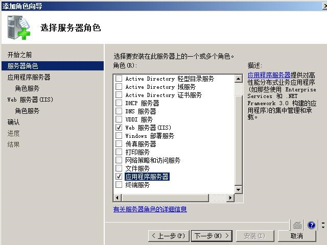

  * 选择 ASP.net和IIS6 管理兼容性  
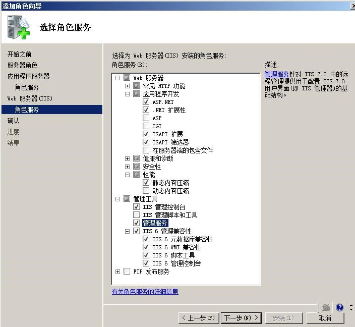 

  * 双击ASP，启动父路径  
  

  * 应用程序运行 32位应用程序  
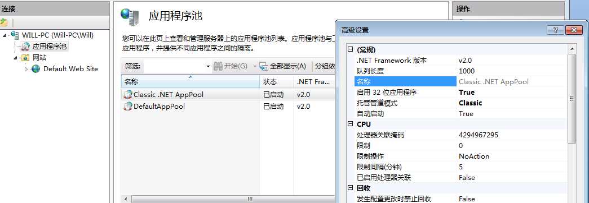  

#### 网页提示：`HTTP 错误 500.23 - Internal Server Error 检测到在集成的托管管道模式下不适用的 ASP.NET 设置`。

**为什么会出现以上错误？**
 * 在IIS7的应用程序池有两种模式，一种是“集成模式”，一种是“经典模式”。
 * 经典模式 则是我们以前习惯的IIS 6 的方式。
 * 如果使用集成模式，那么对自定义的httpModules 和 httpHandlers 就要修改配置文件，需要将他们转移到`<modules>`和`<hanlders>`节里去。
 * 解决方法：`配置应用程序池`

在IIS7上配置应用程序池，并且将程序池的模式改为“经典”，之后一切正常。如图：  
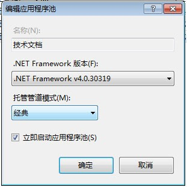 

## 四、局域网其他电脑连接设置
 * 服务器电脑防火墙设置  
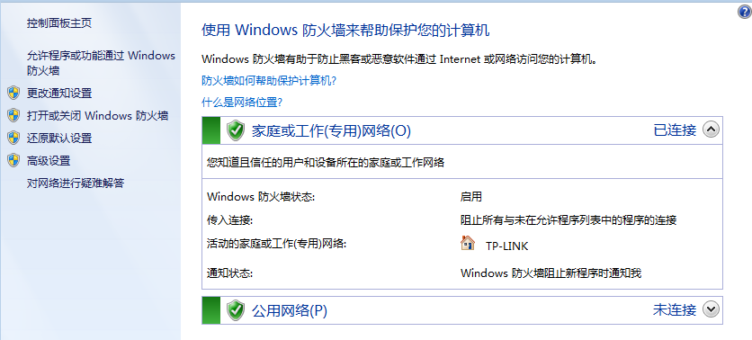

 * 高级设置  
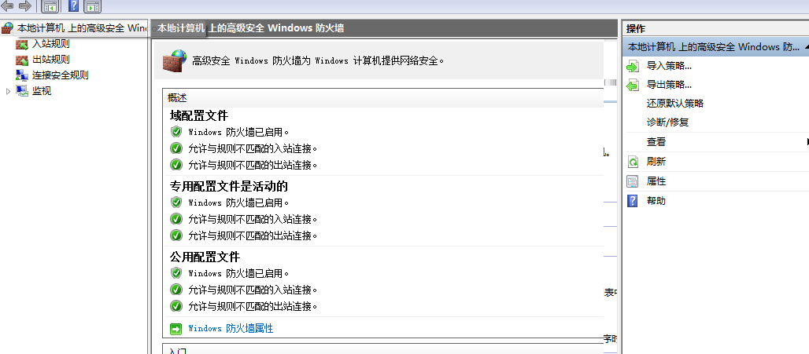

 * 允许程序通过防火墙通信  
 * 选中WEB管理服务  
 * 选中万维网（HTTP）  
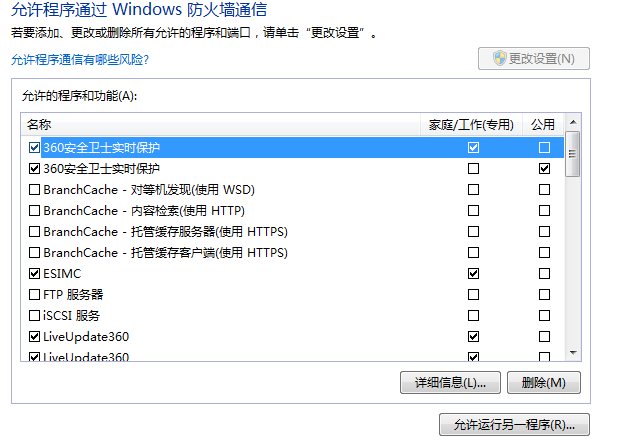

## 五、新手安装SQLSERVER注意事项
数据库目前推荐使用SQL 2008 R2，安装过程中需要注意以下几个配置（请不要无谓的全勾，生产环境根本用不到！）：

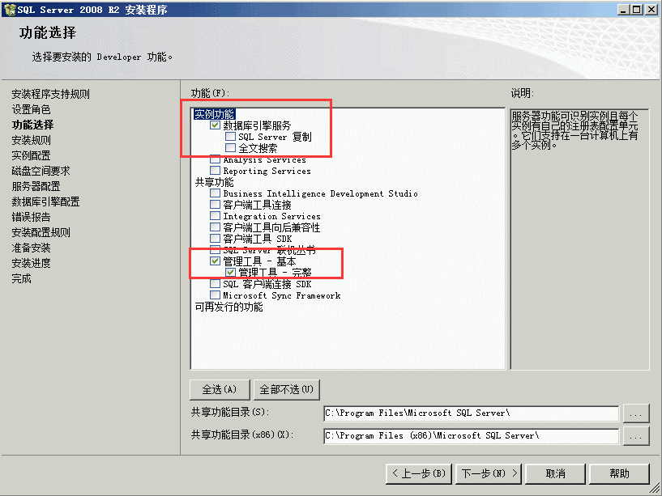
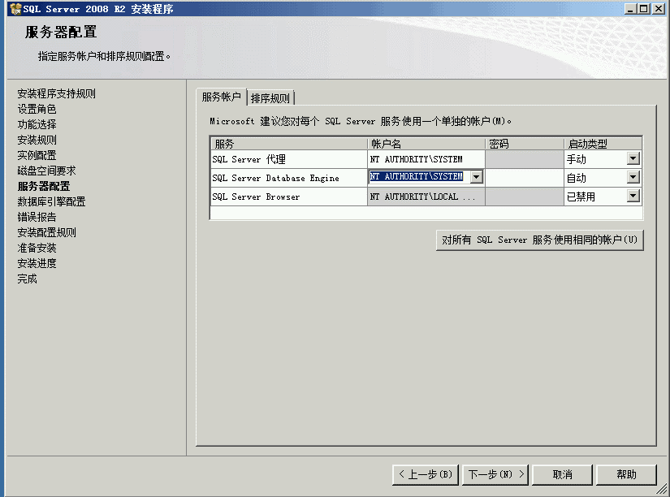
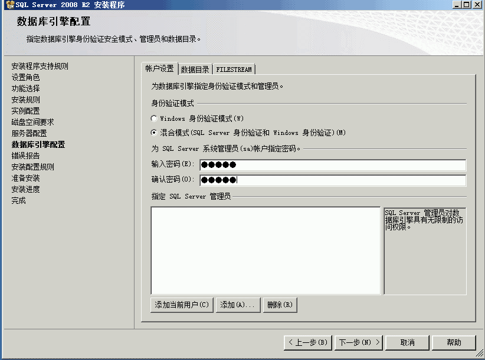
  
*(注意：如果数据库是SQL2008以上，安装时不要勾选安装“示例库”。如果要解决次问题参考以下图片)*  

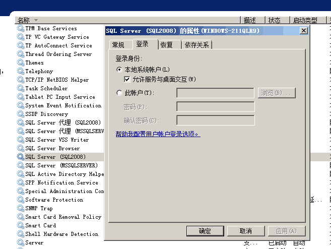

>@木头 
SQL2008安装后激活方式以及提示评估期已过解决方法

第一步：进入SQL2008配置工具中的安装中心  
第二步：再进入维护界面，选择版本升级  
第三步：进入产品密钥，输入密钥  
第四步：一直点下一步，直到升级完毕。  
SQL Server 2008 Developer：PTTFM-X467G-P7RH2-3Q6CG-4DMYB  
SQL Server 2008 Enterprise：JD8Y6-HQG69-P9H84-XDTPG-34MBB  
如以上操作还是连接不进服务器，修改系统时间（把时间提前），即可登录  
 
如果问题依然没有解决还是显示评估期已过(据说这是未安装sql2008sp1的一个bug)  
第一步：先去注册表把HKEY_LOCAL_MACHINE\SOFTWARE\Microsoft\Microsoft SQL   Server\100\ConfigurationState里的CommonFiles 值改成3  
第二步：sql2008安装中心，维护，版本升级重来一次(由于前面已经升级了数据库，所以这次只用升级共享组件)

## 本节贡献者
*@㊣FireFly♂*  
*@张PM*  
*@XゅY*  
 
## links
  * [目录](<preface.md>)
  * 上一节: [上一节](<01.1.md>)
  * 下一节: [下一节](<01.3.md>)
